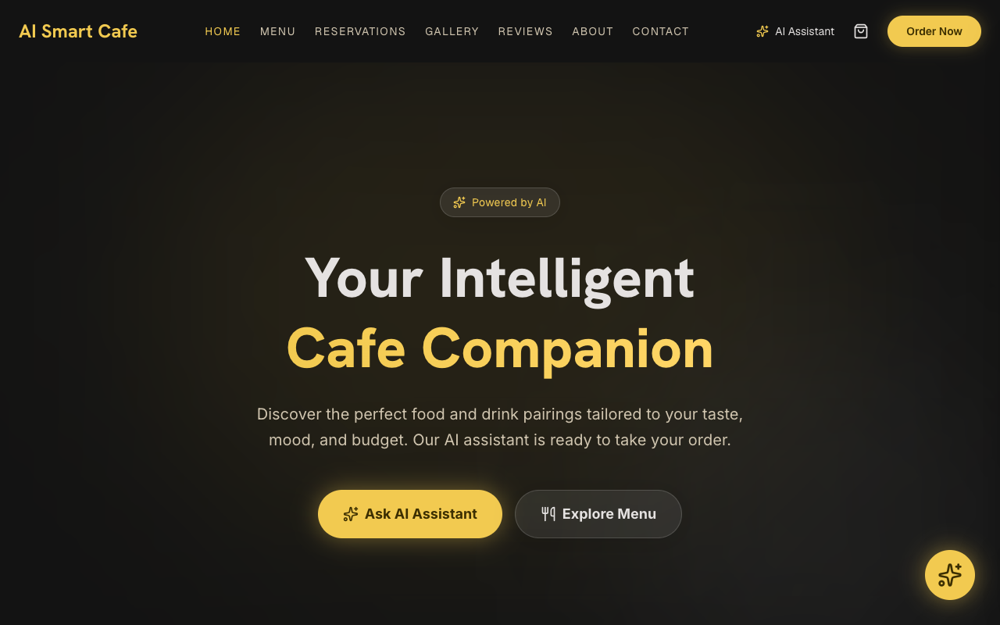
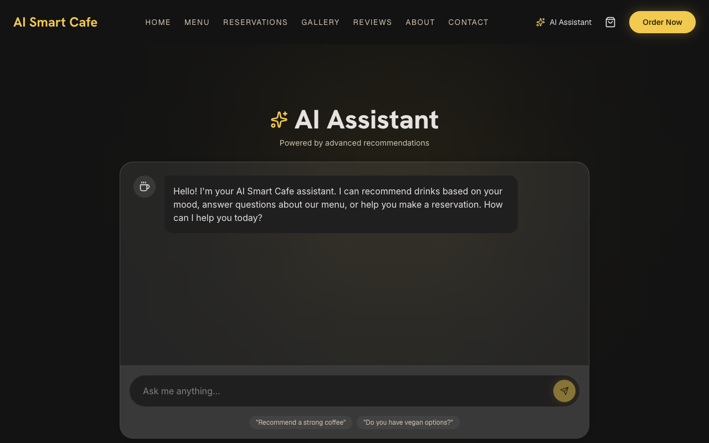
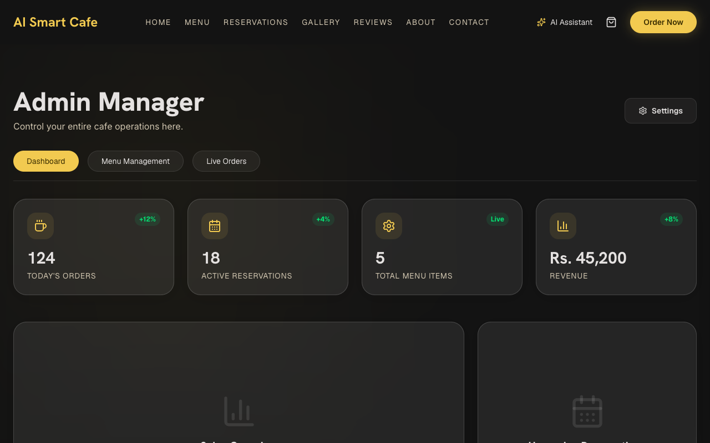

<div align="center">
  <h1>☕ AI Smart Cafe</h1>
  <p><strong>A Next-Generation, AI-Powered Cafe Experience & Management System</strong></p>
  
  [](#)
  [](#)
  [](#)
  [](#)
</div>

---

## 🚀 1. The Idea & Problem Solved

### What is AI Smart Cafe?
**AI Smart Cafe** is a modern, full-stack web application designed to completely revolutionize how customers interact with a coffee shop. It blends a stunning user interface with an integrated AI Barista, alongside a powerful admin dashboard for real-time menu management.

### The Problem It Solves
1. **For Customers (Decision Fatigue):** Walking into a cafe with a massive menu can be overwhelming. Customers often struggle to decide what to order based on their mood, the weather, or dietary preferences. **Solution:** Our built-in AI Barista chats with customers, understands their current vibe, and provides personalized, real-time recommendations.
2. **For Administrators (Static & Outdated Menus):** Cafe managers traditionally rely on static, printed menus that are hard to update. **Solution:** The Admin Dashboard allows managers to add, edit, or remove menu items dynamically. Changes are synced instantly to the customer-facing interface, ensuring the menu is always 100% accurate.

---

## 🌍 2. Live Deployment

The application is fully deployed, highly optimized, and accessible to the public. 

👉 **[CLICK HERE TO VIEW THE LIVE APP](https://online-cafe-phi.vercel.app/)**

> *Note: The deployment is hosted on Vercel, ensuring ultra-fast edge delivery and a seamless user experience.*

---

## ✨ 3. Comprehensive Features List

The application is built with two primary user flows, ensuring a complete end-to-end experience.

### 🧑‍💻 Customer Experience
- **Smart AI Barista:** A real-time chat interface that offers personalized food and drink recommendations.
- **Interactive Digital Menu:** Browse through curated signatures and a full catalog, complete with dynamic category filtering.
- **Seamless Cart & Checkout:** A frictionless shopping cart system powered by global state management, allowing users to add items, view totals, and checkout instantly.
- **Next-Level UI/UX:** Designed with premium glassmorphism effects, glowing gradients, and fluid micro-animations that make the app feel alive.
- **Immersive Media:** Features a high-quality Photo Gallery and an embedded ambiance video to replicate the cozy feel of a real cafe.

### 🛡️ Administrator Capabilities
- **Secure Admin Dashboard:** A dedicated control panel for cafe managers.
- **Dynamic Menu Control:** Instantly add new products (complete with images, pricing, and categories) or delete retired items.
- **Real-Time Data Syncing:** Utilizing Supabase, all database changes reflect immediately on the customer's menu without needing a page refresh.

---

## 🧠 4. The AI Feature Integration

### How It Works
The app integrates **Google Gemini 2.5 Flash** as the core intelligence behind the "AI Barista". Instead of just a standard chatbot, it is engineered to act as a highly knowledgeable, welcoming cafe host. It processes natural language inputs (e.g., *"I had a long night, what's good for energy?"*) and responds with tailored menu suggestions.

### System Prompt & Instructions
To ensure the AI maintains the persona of a premium cafe assistant, the following System Instruction was engineered into the backend API route:

```text
You are a friendly, intelligent AI Assistant for "AI Smart Cafe". 
Your job is to help customers choose coffee, pastries, and other cafe items. 
Always be polite, welcoming, and concise. 
If asked about the cafe, mention it's a modern cafe powered by AI precision and premium ingredients.
If they ask for recommendations, suggest our Signature items like Midnight Espresso, Caramel Cloud Latte, or Matcha Zen.
Format your responses using clean, plain text or simple markdown.
```

---

## 🛠️ 5. Technology Stack & Tools Used

This project was built using industry-standard, modern web technologies to ensure scalability, performance, and a stunning aesthetic.

| Category | Technology / Service | Purpose |
| :--- | :--- | :--- |
| **Frontend Framework** | **Next.js 16 (App Router)** | Server-side rendering, routing, and React architecture. |
| **Styling & UI** | **Tailwind CSS** | Rapid, utility-first UI design with modern CSS capabilities. |
| **State Management** | **Zustand** | Lightweight, fast global state management (used for the Cart). |
| **Icons** | **Lucide React** | Consistent, crisp iconography across the UI. |
| **Backend & Database** | **Supabase (PostgreSQL)** | Relational database storing Menu items, Orders, and Order Items. |
| **AI Model** | **Gemini 2.5 Flash** | Powerful LLM accessed via `@google/generative-ai` SDK. |
| **Deployment** | **Vercel** | CI/CD pipeline and highly optimized edge hosting. |

---

## 📸 6. Project Gallery (Screenshots)

*(Note: Add the screenshots to your `public/screenshots/` folder before final submission to replace these placeholders)*

### 🏠 Customer Home & Menu

*The stunning, immersive landing page and interactive menu.*

### 🤖 AI Barista Assistant

*The Gemini-powered AI chat providing personalized recommendations.*

### ⚙️ Admin Dashboard

*The backend management interface for dynamic menu control.*

---

## 💻 7. Local Setup & Installation Guide

To run this project on your local machine, follow these precise steps:

**1. Clone the Repository:**
```bash
git clone https://github.com/MinhaRiaz/ai-smart-cafe.git
cd ai-smart-cafe
```

**2. Install Dependencies:**
```bash
npm install
```

**3. Configure Environment Variables:**
Create a `.env.local` file in the root of the project and add your API keys:
```env
NEXT_PUBLIC_SUPABASE_URL=your_supabase_project_url
NEXT_PUBLIC_SUPABASE_ANON_KEY=your_supabase_anon_key
GEMINI_API_KEY=your_google_gemini_api_key
```

**4. Setup the Database (Supabase):**
1. Open your Supabase Dashboard and navigate to the **SQL Editor**.
2. Run the provided `supabase_schema.sql` file. This will automatically create the required `menu_items`, `orders`, and `order_items` tables and populate them with initial mock data.

**5. Start the Development Server:**
```bash
npm run dev
```
Navigate to `http://localhost:3000` in your web browser to view the application!

---
<div align="center">
  <i>Developed with ❤️ for the Web Development Assignment.</i>
</div>
